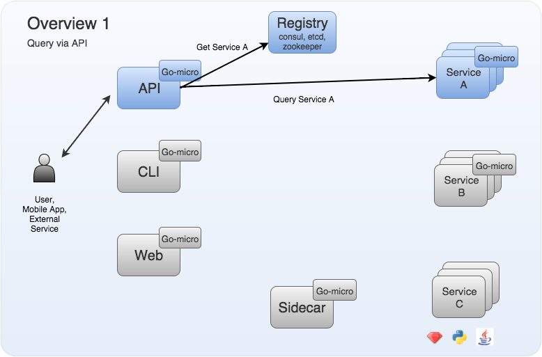
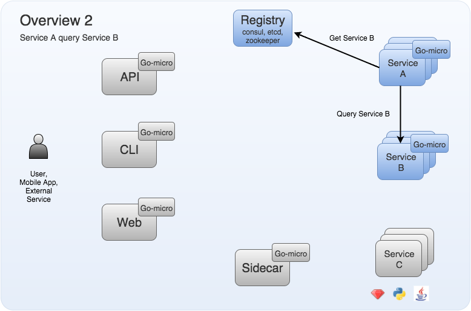

# Architecture

This section should explain more about how micro is constructed, how the various libraries/repos relate to each other 
and how they should be used.

## Micro

Micro is an ecosystem of tools and libraries to simplify developing microservices. By using go-micro you can essentially 
create microservices that are discoverable, can query and be queried via RPC and publish/subscribe events. The wider 
toolset provides everything necessary to run a platform.

-

### CLI

The Micro CLI is a command line version of go-micro which provides a way of observing and interacting with a running 
environment.

### API

The API acts as a gateway or proxy to enable a single entry point for accessing micro services. It should be run on 
the edge of your infrastructure. It converts HTTP requests to RPC and forwards to the appropriate service.

### Web UI

The UI is a web version of go-micro allowing visual interaction into an environmet. In the future it will be a way 
of aggregating micro web services also. It includes a way to proxy to web apps. /[name] will route to a 
a service in the registry. The Web UI adds Prefix of "go.micro.web." (which can be configured) to the name, looks 
it up in the registry and then reverse proxies to it.

### Sidecar

The sidecar is a HTTP Interface version of go-micro. It's a way of integrating non-Go appications into a micro 
environment. 

## Overview

Below is an overview of how services within a micro environment interact. Each time a service needs to make a 
request, it will lookup the service name within the registry then directly send a request to an instance of 
the service.

-

-

## Go Micro

### Registry

The registry provides a pluggable service discovery library to find running services. Current implementations 
are consul, etcd, memory and kubernetes. The interface is easily implemented if your preferences differ.

### Selector

The selector provides a load balancing mechanism via selection. When a client makes a request to a service it 
will first query the registry for the service. This usually returns a list of running nodes representing 
the service. A selector will select one of these nodes to be used for querying. Multiple calls to the selector 
will allow balancing algorithms to be utilised. Current methods are round robin, random hashed and blacklist. 

### Broker

The broker is pluggable interface for pub/sub. Microservices are an event driven architecture where a publishing 
and subscribing to events should be a first class citizen. Current implementations include nats, rabbitmq and http 
(for development).

### Transport

Transport is a pluggable interface over point to point transfer of messages. Current implementations are http, 
rabbitmq and nats. By providing this abstraction, transports can be swapped out seamlessly.

### Client

The client provides a way to make RPC queries. It combines the registry, selector, broker and transport. It also 
provides retries, timeouts, use of context, etc.

### Server

The server is an interface to build a running microservice. It provides a way of serving RPC requests. 

## Go Platform

The go platform is a feature rich higher level library to build on go-micro. It provides the necessary systems 
for running a microservice platform at scale. 

### Auth

### Config

### DB

### Discovery

### KV

### Log

### Monitor

### Metrics

### Router

### Trace

Distributed tracing system. Allows every request to be tracked and observed after. Within a microservices world 
a single request could result in fan out to dozens of other services. Keeping track of what was touched or 
what failed is incredibly difficult. Tracing provides a way to make sense of this.

## Go Plugins

Go plugins is a place to share implementations of the go-micro and go-platform interfaces. 

## Code Generation

Micro provides experimental code generation to reduce the amount of boiler plate code needed to be written. An example 
of how to use code generation can be found [here](https://github.com/micro/go-micro/tree/master/examples/client/codegen).
